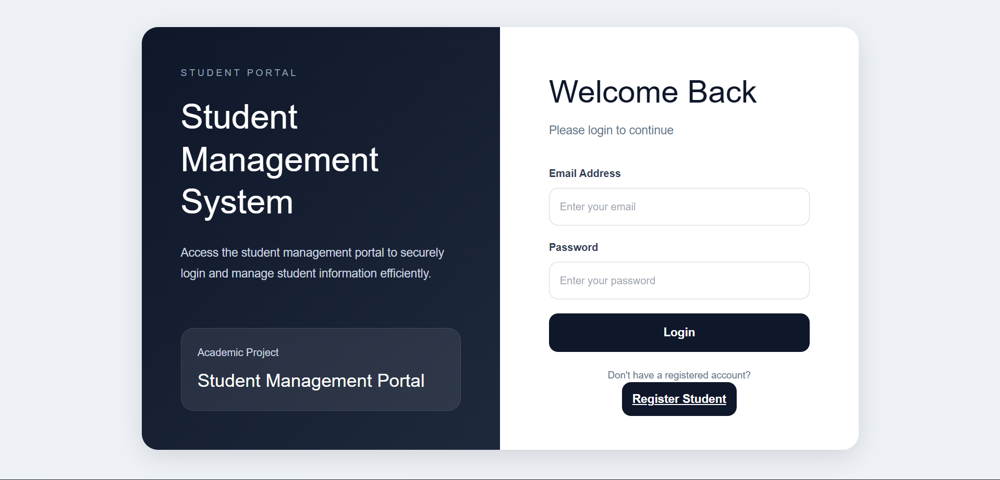
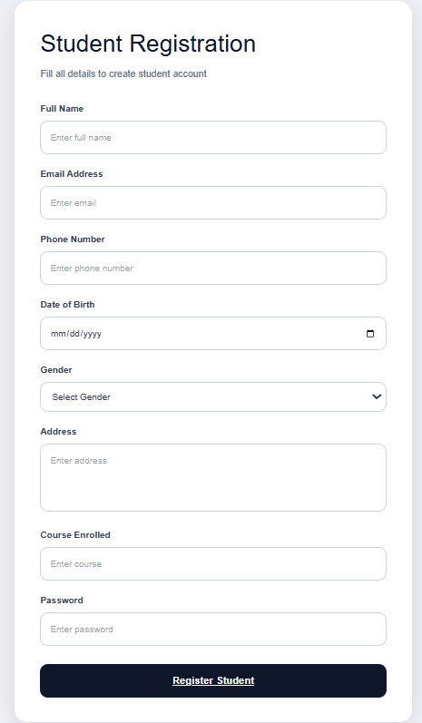
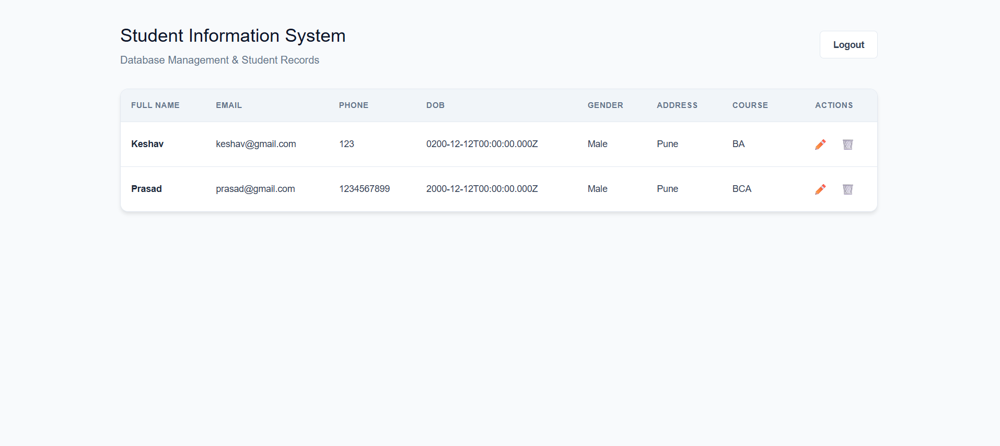

# Frontend - Student Management System

## Tech Stack
React + TypeScript, Axios, CryptoJS

## Features
- Login form
- Student registration form
- CRUD operations
- API integration with backend

## Encryption
Data is encrypted using AES before sending to backend.

## Screenshots

### Login

### Register

### Student List

## Run Project
npm install  
npm run dev