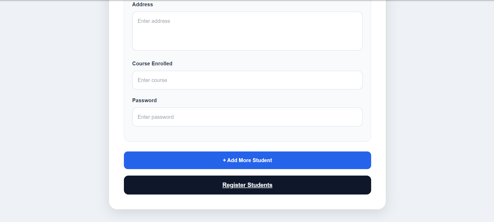
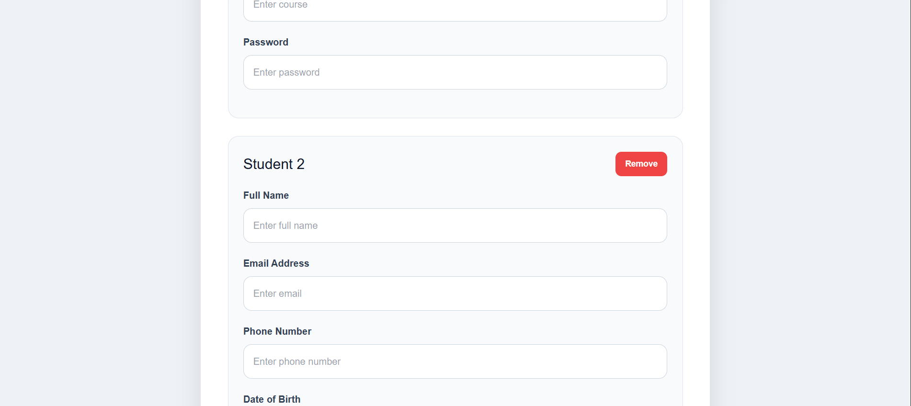

# Frontend - Secure Student Management System with Multiple Student Registration, Dual Layer Encryption, Authentication, and CRUD Operations.

## Tech Stack
React + TypeScript, Axios, CryptoJS

## Features
- Multiple Student Registration
- Dynamic Student Forms
- Remove Student Functionality
- Duplicate Email Validation
- Database Email Validation
- Frontend Encryption
- Login System
- Responsive UI

## Encryption
Data is encrypted using AES before sending to backend.

## Screenshots

### Login

### Register

### Multi Students Register Functionality

### Multi Students Register Form

### Student List

## Run Project
npm install  
npm run dev